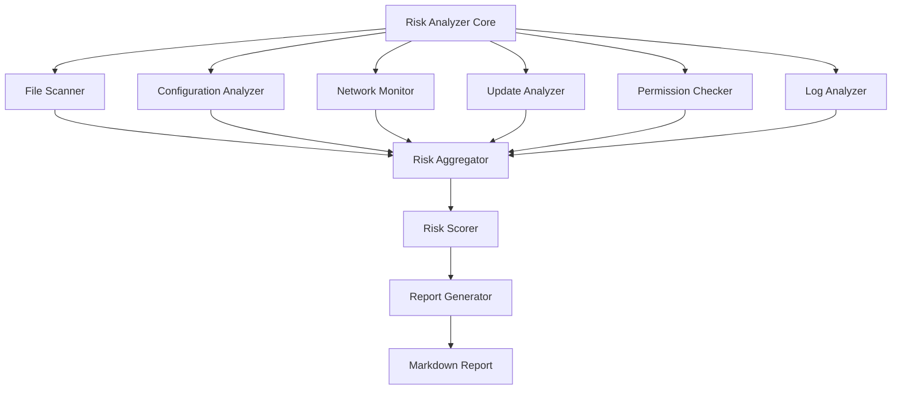
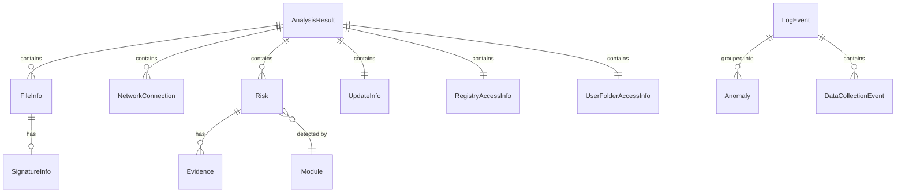

# Tài Liệu Thiết Kế - Phân Tích Rủi Ro Phần Mềm Gridex

## Tổng Quan

Hệ thống phân tích rủi ro Gridex là một công cụ bảo mật tĩnh (static analysis) được thiết kế để đánh giá các mối nguy tiềm ẩn từ phần mềm Gridex đã được cài đặt trên hệ thống Windows. Công cụ thực hiện phân tích toàn diện về cấu trúc tệp tin, cấu hình, quyền truy cập, hoạt động mạng và cơ chế cập nhật để xác định các rủi ro về bảo mật và quyền riêng tư.

### Mục Tiêu Thiết Kế

1. **Phân tích tĩnh không xâm nhập**: Công cụ chỉ đọc và phân tích dữ liệu hiện có mà không thay đổi hoặc can thiệp vào hoạt động của phần mềm Gridex
2. **Đánh giá rủi ro dựa trên bằng chứng**: Mọi kết luận về rủi ro đều dựa trên dữ liệu cụ thể được thu thập từ hệ thống
3. **Báo cáo rõ ràng và hành động được**: Cung cấp thông tin chi tiết với các đề xuất khắc phục cụ thể
4. **Khả năng mở rộng**: Kiến trúc module cho phép thêm các loại phân tích mới trong tương lai

### Phạm Vi

**Trong phạm vi:**
- Quét và phân tích cấu trúc thư mục tại `C:\Users\Admin\AppData\Local\Gridex`
- Phân tích tệp cấu hình (settings.json) để phát hiện thông tin nhạy cảm
- Phân tích nhật ký (velopack.log) để xác định hoạt động mạng và hành vi
- Kiểm tra quyền truy cập tệp tin và registry
- Phân tích cơ chế cập nhật Velopack
- Tính toán hash và kiểm tra chữ ký số của tệp thực thi
- Tạo báo cáo định dạng Markdown

**Ngoài phạm vi:**
- Phân tích động (runtime analysis) hoặc giám sát thời gian thực
- Phân tích mã nguồn hoặc reverse engineering
- Phân tích lưu lượng mạng trực tiếp
- Tích hợp với antivirus hoặc EDR
- Gỡ bỏ hoặc vô hiệu hóa phần mềm Gridex

## Kiến Trúc

### Kiến Trúc Tổng Thể

Hệ thống sử dụng kiến trúc pipeline với các module phân tích độc lập, mỗi module chịu trách nhiệm cho một khía cạnh cụ thể của phân tích rủi ro.



### Luồng Xử Lý

1. **Khởi tạo**: Risk Analyzer Core khởi tạo và xác thực đường dẫn cài đặt
2. **Thu thập dữ liệu**: Các module phân tích chạy song song để thu thập thông tin
3. **Phát hiện rủi ro**: Mỗi module xác định các rủi ro trong phạm vi của nó
4. **Tổng hợp**: Risk Aggregator thu thập tất cả các phát hiện
5. **Tính điểm**: Risk Scorer tính toán mức độ rủi ro tổng thể
6. **Báo cáo**: Report Generator tạo báo cáo Markdown chi tiết

### Nguyên Tắc Thiết Kế

- **Separation of Concerns**: Mỗi module có trách nhiệm rõ ràng và không phụ thuộc lẫn nhau
- **Fail-Safe**: Lỗi trong một module không làm dừng toàn bộ phân tích
- **Extensibility**: Dễ dàng thêm module phân tích mới
- **Testability**: Mỗi module có thể được kiểm thử độc lập

## Các Thành Phần và Giao Diện

### 1. Risk Analyzer Core

**Trách nhiệm:**
- Điều phối toàn bộ quá trình phân tích
- Quản lý vòng đời của các module
- Xử lý lỗi và logging

**Giao diện:**
```python
class RiskAnalyzer:
    def __init__(self, installation_path: str)
    def analyze() -> AnalysisResult
    def get_modules() -> List[AnalysisModule]
```

### 2. File Scanner

**Trách nhiệm:**
- Quét cấu trúc thư mục đệ quy
- Thu thập metadata của tệp tin (kích thước, ngày tạo, ngày sửa đổi)
- Xác định loại tệp tin
- Tính toán hash SHA256 cho tệp thực thi
- Phát hiện tệp tin ẩn và tệp tin đáng ngờ
- Kiểm tra chữ ký số của tệp thực thi

**Giao diện:**
```python
class FileScanner:
    def scan_directory(path: str) -> List[FileInfo]
    def calculate_hash(file_path: str) -> str
    def check_digital_signature(file_path: str) -> SignatureInfo
    def detect_suspicious_files(files: List[FileInfo]) -> List[SecurityRisk]
```

**Cấu trúc dữ liệu:**
```python
@dataclass
class FileInfo:
    path: str
    size: int
    created_date: datetime
    modified_date: datetime
    file_type: str
    is_hidden: bool
    is_executable: bool
    hash_sha256: Optional[str]
    signature_info: Optional[SignatureInfo]

@dataclass
class SignatureInfo:
    is_signed: bool
    signer: Optional[str]
    is_valid: bool
    timestamp: Optional[datetime]
```

### 3. Configuration Analyzer

**Trách nhiệm:**
- Phân tích tệp settings.json
- Phát hiện thông tin nhạy cảm (API keys, tokens, passwords)
- Kiểm tra quyền truy cập tệp cấu hình
- Xác định dữ liệu cá nhân được lưu trữ

**Giao diện:**
```python
class ConfigurationAnalyzer:
    def parse_config(file_path: str) -> Dict[str, Any]
    def detect_sensitive_data(config: Dict) -> List[SensitiveDataFinding]
    def check_file_permissions(file_path: str) -> PermissionInfo
    def analyze() -> List[Risk]
```

**Cấu trúc dữ liệu:**
```python
@dataclass
class SensitiveDataFinding:
    field_name: str
    data_type: str  # "api_key", "password", "token", "email", "user_id"
    is_plaintext: bool
    value_preview: str  # First/last few characters only

@dataclass
class PermissionInfo:
    owner: str
    group: str
    permissions: str
    is_world_readable: bool
```

### 4. Network Monitor

**Trách nhiệm:**
- Phân tích log file để xác định kết nối mạng
- Trích xuất domain, IP, port
- Xác định mục đích kết nối
- Kiểm tra sử dụng HTTPS vs HTTP
- Phát hiện kết nối đến domain không rõ nguồn gốc

**Giao diện:**
```python
class NetworkMonitor:
    def parse_log_file(log_path: str) -> List[NetworkConnection]
    def identify_connection_purpose(connection: NetworkConnection) -> str
    def check_encryption(connection: NetworkConnection) -> bool
    def detect_suspicious_connections(connections: List[NetworkConnection]) -> List[SecurityRisk]
```

**Cấu trúc dữ liệu:**
```python
@dataclass
class NetworkConnection:
    domain: str
    ip_address: Optional[str]
    port: int
    protocol: str  # "http", "https", "tcp", "udp"
    purpose: str  # "update", "api", "telemetry", "unknown"
    timestamp: datetime
    is_encrypted: bool
```

### 5. Update Analyzer

**Trách nhiệm:**
- Xác định cơ chế cập nhật (Velopack)
- Phân tích quy trình cập nhật từ log
- Xác định nguồn cập nhật
- Kiểm tra xác thực chữ ký số
- Kiểm tra quyền của Update.exe

**Giao diện:**
```python
class UpdateAnalyzer:
    def identify_update_mechanism() -> str
    def parse_update_process(log_path: str) -> UpdateInfo
    def check_signature_verification() -> bool
    def check_update_exe_permissions(exe_path: str) -> PermissionInfo
    def analyze() -> List[Risk]
```

**Cấu trúc dữ liệu:**
```python
@dataclass
class UpdateInfo:
    mechanism: str  # "velopack"
    update_source_url: str
    update_source_domain: str
    has_signature_verification: bool
    update_exe_path: str
    update_exe_permissions: PermissionInfo
    last_update_check: Optional[datetime]
    last_update_install: Optional[datetime]
```

### 6. Permission Checker

**Trách nhiệm:**
- Kiểm tra quyền truy cập của tệp thực thi
- Xác định quyền đặc biệt (admin, system)
- Kiểm tra quyền truy cập registry
- Kiểm tra quyền truy cập thư mục người dùng

**Giao diện:**
```python
class PermissionChecker:
    def check_executable_permissions(exe_path: str) -> ExecutablePermissions
    def check_registry_access() -> RegistryAccessInfo
    def check_user_folder_access() -> UserFolderAccessInfo
    def analyze() -> List[Risk]
```

**Cấu trúc dữ liệu:**
```python
@dataclass
class ExecutablePermissions:
    path: str
    has_admin_rights: bool
    has_system_rights: bool
    can_write_system_folders: bool
    permissions: PermissionInfo

@dataclass
class RegistryAccessInfo:
    can_read_system_registry: bool
    can_write_system_registry: bool
    registry_keys_accessed: List[str]

@dataclass
class UserFolderAccessInfo:
    can_read_documents: bool
    can_read_desktop: bool
    can_read_downloads: bool
    folders_accessed: List[str]
```

### 7. Log Analyzer

**Trách nhiệm:**
- Phân tích velopack.log
- Trích xuất các sự kiện
- Xác định lỗi và cảnh báo
- Phát hiện mẫu hoạt động bất thường
- Xác định việc thu thập và gửi dữ liệu người dùng

**Giao diện:**
```python
class LogAnalyzer:
    def parse_log(log_path: str) -> List[LogEvent]
    def extract_errors_and_warnings(events: List[LogEvent]) -> List[LogEvent]
    def detect_anomalies(events: List[LogEvent]) -> List[Anomaly]
    def detect_data_collection(events: List[LogEvent]) -> List[DataCollectionEvent]
    def analyze() -> List[Risk]
```

**Cấu trúc dữ liệu:**
```python
@dataclass
class LogEvent:
    timestamp: datetime
    level: str  # "info", "warning", "error"
    message: str
    category: str  # "network", "file_access", "update", "error"

@dataclass
class Anomaly:
    pattern: str  # "repeated_connection_failure", "repeated_access_denied"
    occurrences: int
    first_seen: datetime
    last_seen: datetime
    severity: str

@dataclass
class DataCollectionEvent:
    timestamp: datetime
    data_type: str  # "user_id", "tracking_id", "usage_stats"
    destination: str
    is_encrypted: bool
```

### 8. Risk Aggregator

**Trách nhiệm:**
- Thu thập tất cả rủi ro từ các module
- Loại bỏ trùng lặp
- Phân loại rủi ro

**Giao diện:**
```python
class RiskAggregator:
    def add_risks(risks: List[Risk])
    def get_all_risks() -> List[Risk]
    def get_security_risks() -> List[SecurityRisk]
    def get_privacy_risks() -> List[PrivacyRisk]
```

**Cấu trúc dữ liệu:**
```python
@dataclass
class Risk:
    risk_id: str
    risk_type: str  # "security" or "privacy"
    severity: str  # "low", "medium", "high", "critical"
    title: str
    description: str
    evidence: List[str]
    remediation: str
    source_module: str

class SecurityRisk(Risk):
    risk_type: str = "security"

class PrivacyRisk(Risk):
    risk_type: str = "privacy"
```

### 9. Risk Scorer

**Trách nhiệm:**
- Tính toán điểm rủi ro cho từng phát hiện
- Tính toán điểm rủi ro tổng thể
- Xác định mức độ rủi ro tổng thể
- Xác định các rủi ro ưu tiên

**Giao diện:**
```python
class RiskScorer:
    def calculate_risk_score(risk: Risk) -> int
    def calculate_total_score(risks: List[Risk]) -> int
    def determine_risk_level(total_score: int) -> str
    def identify_priority_risks(risks: List[Risk]) -> List[Risk]
```

**Công thức tính điểm:**
- Low (Thấp): 5 điểm
- Medium (Trung Bình): 15 điểm
- High (Cao): 30 điểm
- Critical (Nghiêm Trọng): 50 điểm

**Phân loại mức độ rủi ro tổng thể:**
- Thấp: 0-25 điểm
- Trung Bình: 26-50 điểm
- Cao: 51-75 điểm
- Nghiêm Trọng: 76-100 điểm

### 10. Report Generator

**Trách nhiệm:**
- Tạo báo cáo Markdown có cấu trúc
- Bao gồm tóm tắt điều hành
- Liệt kê chi tiết từng rủi ro
- Cung cấp đề xuất khắc phục
- Xuất báo cáo ra tệp tin

**Giao diện:**
```python
class ReportGenerator:
    def generate_report(analysis_result: AnalysisResult) -> str
    def write_report(report: str, output_path: str)
```

**Cấu trúc báo cáo:**
1. Tiêu đề và metadata (timestamp, phiên bản công cụ)
2. Tóm tắt điều hành (mức độ rủi ro tổng thể, số lượng rủi ro)
3. Các rủi ro ưu tiên
4. Chi tiết rủi ro bảo mật
5. Chi tiết rủi ro quyền riêng tư
6. Danh sách kết nối mạng
7. Thông tin cấu trúc tệp tin
8. Đề xuất khắc phục

## Mô Hình Dữ Liệu

### AnalysisResult

```python
@dataclass
class AnalysisResult:
    analysis_id: str
    timestamp: datetime
    installation_path: str
    tool_version: str
    
    # File scanning results
    files: List[FileInfo]
    suspicious_files: List[FileInfo]
    
    # Configuration analysis
    config_data: Optional[Dict[str, Any]]
    sensitive_data_findings: List[SensitiveDataFinding]
    
    # Network analysis
    network_connections: List[NetworkConnection]
    suspicious_connections: List[NetworkConnection]
    
    # Update analysis
    update_info: UpdateInfo
    
    # Permission analysis
    executable_permissions: List[ExecutablePermissions]
    registry_access: RegistryAccessInfo
    user_folder_access: UserFolderAccessInfo
    
    # Log analysis
    log_events: List[LogEvent]
    anomalies: List[Anomaly]
    data_collection_events: List[DataCollectionEvent]
    
    # Risk assessment
    security_risks: List[SecurityRisk]
    privacy_risks: List[PrivacyRisk]
    total_risk_score: int
    risk_level: str
    priority_risks: List[Risk]
```

### Quan Hệ Giữa Các Thực Thể




## Thuật Toán Phát Hiện Rủi Ro

### Phát Hiện Thông Tin Nhạy Cảm

Sử dụng regex patterns để phát hiện các trường nhạy cảm:
- API Key: `api[_-]?key`, `apikey`, `api[_-]?secret`
- Password: `password`, `passwd`, `pwd`
- Token: `token`, `auth[_-]?token`, `access[_-]?token`
- Email: pattern email chuẩn
- User ID: `user[_-]?id`, `userid`, `uid`

### Phát Hiện Kết Nối Đáng Ngờ

Danh sách domain đáng tin cậy (whitelist):
- Domain chính thức của Gridex
- Domain cập nhật Velopack
- Domain API công khai phổ biến

Kết nối đến domain không có trong whitelist được đánh dấu là đáng ngờ.

### Phát Hiện Tệp Tin Đáng Ngờ

Patterns cho tên tệp tin đáng ngờ:
- Tên ngẫu nhiên: chuỗi ký tự hex dài (>16 ký tự)
- Tên không có nghĩa: không chứa từ tiếng Anh hoặc tiếng Việt
- Phần mở rộng kép: `.pdf.exe`, `.doc.exe`
- Tên giống tệp hệ thống: `svchost.exe`, `explorer.exe` nhưng ở vị trí sai

### Phát Hiện Mẫu Bất Thường

Anomaly detection dựa trên:
- Tần suất: sự kiện lặp lại > 10 lần trong 1 phút
- Lỗi liên tiếp: cùng loại lỗi xảy ra > 5 lần liên tiếp
- Thời gian bất thường: hoạt động vào giờ không bình thường (2-5 AM)

## Xử Lý Lỗi

### Chiến Lược Xử Lý Lỗi

1. **Graceful Degradation**: Lỗi trong một module không làm dừng toàn bộ phân tích
2. **Error Logging**: Tất cả lỗi được ghi lại với context đầy đủ
3. **Partial Results**: Trả về kết quả từ các module thành công
4. **User Notification**: Thông báo rõ ràng về các phần phân tích bị lỗi

### Các Loại Lỗi

**File System Errors:**
- Path không tồn tại: Log warning, skip analysis
- Permission denied: Log warning, đánh dấu là security concern
- File locked: Retry 3 lần với exponential backoff

**Parsing Errors:**
- Invalid JSON: Log error, skip config analysis
- Malformed log: Log warning, parse best-effort
- Unknown format: Log warning, skip specific entry

**System Errors:**
- Registry access denied: Log warning, skip registry analysis
- Insufficient privileges: Log warning, note in report

**Resource Errors:**
- Out of memory: Implement streaming for large files
- Disk full: Fail gracefully with clear error message
- Timeout: Set reasonable timeouts for each operation

### Error Recovery

```python
class AnalysisError(Exception):
    def __init__(self, module: str, operation: str, details: str):
        self.module = module
        self.operation = operation
        self.details = details

class ErrorHandler:
    def handle_error(error: AnalysisError) -> ErrorHandlingResult:
        # Log error
        logger.error(f"{error.module}.{error.operation}: {error.details}")
        
        # Determine if analysis can continue
        if error.is_critical():
            return ErrorHandlingResult.ABORT
        else:
            return ErrorHandlingResult.CONTINUE
```

## Chiến Lược Kiểm Thử

### Tổng Quan

Hệ thống sử dụng kết hợp property-based testing và example-based testing để đảm bảo tính đúng đắn toàn diện.

### Property-Based Testing

**Thư viện**: Hypothesis (Python)

**Cấu hình**:
- Minimum 100 iterations per property test
- Mỗi property test phải tham chiếu đến property trong tài liệu thiết kế
- Tag format: `Feature: gridex-risk-analysis, Property {number}: {property_text}`

**Phạm vi áp dụng**:
- Parsing logic (JSON, logs)
- Risk scoring algorithms
- Pattern detection
- Report generation
- Classification logic

### Unit Testing

**Phạm vi áp dụng**:
- Specific examples demonstrating correct behavior
- Edge cases (empty inputs, boundary values)
- Error conditions
- Integration points between modules

**Không nên viết quá nhiều unit tests** - property-based tests đã xử lý việc kiểm tra nhiều đầu vào. Unit tests nên tập trung vào:
- Các ví dụ cụ thể minh họa hành vi đúng
- Điểm tích hợp giữa các components
- Các trường hợp biên và điều kiện lỗi

### Integration Testing

**Phạm vi áp dụng**:
- File system operations (actual file I/O)
- Permission checking (actual Windows permissions)
- Digital signature verification (actual crypto operations)
- Registry access (actual Windows registry)
- Hash calculation (actual file reading and hashing)

**Chiến lược**: 1-3 representative examples per integration point

### Test Data Generation

**Generators cho Property-Based Testing**:
- Random directory structures
- Random JSON configurations with various schemas
- Random log files with various event patterns
- Random file metadata
- Random network connection data
- Random risk sets with various severities

### Test Coverage Goals

- Line coverage: >80%
- Branch coverage: >75%
- Property coverage: 100% of identified properties
- Integration coverage: All external dependencies

## Correctness Properties

*A property is a characteristic or behavior that should hold true across all valid executions of a system—essentially, a formal statement about what the system should do. Properties serve as the bridge between human-readable specifications and machine-verifiable correctness guarantees.*

### Property Reflection

After analyzing all acceptance criteria, I identified the following areas of potential redundancy:

1. **File scanning completeness**: Properties 1.1, 1.2, and 1.3 all relate to completeness of file scanning. These can be combined into a single comprehensive property about complete directory traversal with full metadata.

2. **Risk flagging conditionals**: Many properties (2.3, 2.5, 3.4, 3.6, 4.5, 4.7, 5.4, 5.6, 6.4, 6.6, 7.5, 7.7, 8.5, 10.4, 10.6, 10.8) follow the same pattern: "IF condition THEN flag risk at level X". These can be grouped into a single property about correct risk flagging given conditions.

3. **Parsing completeness**: Properties about parsing (2.1, 3.1, 6.1) all follow the same pattern of complete extraction. These can be combined into a general parsing completeness property.

4. **Report completeness**: Properties 9.2, 9.3, 9.4, 9.5, 9.6, 9.8 all relate to report content completeness. These can be combined into a single property about complete report generation.

After reflection, I will write consolidated properties that eliminate redundancy while maintaining complete validation coverage.

### Property 1: Directory Traversal Completeness

*For any* directory structure, when the File_Scanner scans a root path, the results SHALL include all files and subdirectories with complete metadata (full path, size, creation date, modification date, file type).

**Validates: Requirements 1.1, 1.2, 1.3, 1.4**

### Property 2: Configuration Parsing Round-Trip

*For any* valid JSON configuration file, parsing and then serializing the configuration SHALL produce an equivalent structure.

**Validates: Requirements 2.1**

### Property 3: Sensitive Data Detection Completeness

*For any* configuration containing fields with sensitive patterns (api_key, password, token, email, user_id), the Risk_Analyzer SHALL detect all such fields.

**Validates: Requirements 2.2, 10.1, 10.2**

### Property 4: Risk Flagging Correctness

*For any* analysis result with specific conditions (plaintext credentials, world-readable config, unknown domain connection, HTTP usage, no signature verification, system write permissions, registry write access, user folder read access, >10 system access errors, user data transmission, unencrypted personal data, tracking ID), the Risk_Analyzer SHALL flag the corresponding risk at the correct severity level.

**Validates: Requirements 2.3, 2.5, 3.4, 3.6, 4.5, 4.7, 5.4, 5.6, 6.4, 6.6, 7.5, 7.7, 8.5, 10.4, 10.6, 10.8**

### Property 5: Log Parsing Completeness

*For any* log file with structured events, the Log_Analyzer SHALL extract all events with their complete attributes (timestamp, level, message, category).

**Validates: Requirements 3.1, 6.1**

### Property 6: Network Connection Extraction

*For any* log file containing network connection entries, the Network_Monitor SHALL extract all connections with complete information (domain, IP, port, protocol).

**Validates: Requirements 3.1, 3.2**

### Property 7: Connection Purpose Classification

*For any* network connection with URL patterns matching known purposes (update, API, telemetry), the Network_Monitor SHALL correctly classify the connection purpose.

**Validates: Requirements 3.3**

### Property 8: Protocol Detection

*For any* URL or connection string, the Network_Monitor SHALL correctly identify whether the protocol is encrypted (HTTPS) or unencrypted (HTTP).

**Validates: Requirements 3.5**

### Property 9: Update Mechanism Detection

*For any* installation directory containing Velopack artifacts (Update.exe, velopack.log), the Risk_Analyzer SHALL correctly identify Velopack as the update mechanism.

**Validates: Requirements 4.1**

### Property 10: Update Process Parsing

*For any* log file containing update events, the Update_Analyzer SHALL extract update information including source URL and domain.

**Validates: Requirements 4.2, 4.3**

### Property 11: Error and Warning Filtering

*For any* log file with events at various levels, the Log_Analyzer SHALL correctly identify and filter all error and warning events.

**Validates: Requirements 6.2**

### Property 12: Anomaly Pattern Detection

*For any* sequence of log events containing repeated patterns (>10 occurrences of same event type), the Log_Analyzer SHALL detect the anomaly pattern.

**Validates: Requirements 6.3**

### Property 13: Data Collection Event Detection

*For any* log file containing patterns indicating data collection or transmission, the Risk_Analyzer SHALL detect these events.

**Validates: Requirements 6.5, 10.3**

### Property 14: Executable File Identification

*For any* list of files, the File_Scanner SHALL correctly identify all files with executable extensions (.exe, .dll, .bat).

**Validates: Requirements 7.1**

### Property 15: Hash Database Lookup

*For any* file hash and hash database, the File_Scanner SHALL correctly determine whether the hash exists in the database.

**Validates: Requirements 7.3**

### Property 16: Suspicious Filename Detection

*For any* filename with suspicious patterns (random hex strings >16 chars, double extensions, system-like names in wrong locations), the File_Scanner SHALL detect it as suspicious.

**Validates: Requirements 7.4**

### Property 17: Risk Aggregation Completeness

*For any* set of risks from multiple analysis modules, the Risk_Aggregator SHALL include all risks in the aggregated result.

**Validates: Requirements 8.1**

### Property 18: Risk Score Calculation

*For any* set of risks with defined severities (Low=5, Medium=15, High=30, Critical=50), the Risk_Scorer SHALL calculate the correct total score as the sum of individual risk scores.

**Validates: Requirements 8.2**

### Property 19: Risk Level Classification

*For any* total risk score, the Risk_Scorer SHALL classify it into the correct level: Low (0-25), Medium (26-50), High (51-75), or Critical (76-100).

**Validates: Requirements 8.3**

### Property 20: Priority Risk Identification

*For any* set of risks, the Risk_Scorer SHALL correctly identify all risks with severity High or Critical as priority risks.

**Validates: Requirements 8.4**

### Property 21: Report Structure Completeness

*For any* analysis result, the Report_Generator SHALL produce a report containing all required sections: executive summary with risk level, detailed security risks, detailed privacy risks, network connections list, remediation suggestions, timestamp, and tool version.

**Validates: Requirements 9.1, 9.2, 9.3, 9.4, 9.5, 9.6, 9.8**

### Property 22: Markdown Format Validity

*For any* analysis result, the Report_Generator SHALL produce valid Markdown format with proper heading hierarchy, lists, and code blocks.

**Validates: Requirements 9.7**

### Property 23: Encryption Status Detection

*For any* data transmission event in logs or configuration, the Risk_Analyzer SHALL correctly determine whether encryption indicators (HTTPS, TLS, encrypted=true) are present.

**Validates: Requirements 10.5**

### Property 24: Tracking ID Detection

*For any* configuration or log containing tracking ID patterns (tracking_id, analytics_id, session_id), the Risk_Analyzer SHALL detect the tracking ID.

**Validates: Requirements 10.7**

