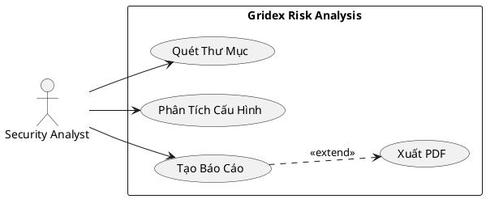

# Use Case (Trường Hợp Sử Dụng)

## Định Nghĩa

**Use Case** là một kỹ thuật mô tả cách người dùng (actor) tương tác với hệ thống để đạt được một mục tiêu cụ thể. Use case tập trung vào "ai làm gì" và "hệ thống phản ứng như thế nào".

## Thành Phần Của Use Case

### 1. Actor (Tác Nhân)
- Người hoặc hệ thống tương tác với hệ thống
- Có thể là:
  - **Primary Actor**: Người khởi xướng use case
  - **Secondary Actor**: Hệ thống hỗ trợ khác

### 2. Use Case Name (Tên Use Case)
- Động từ + danh từ
- Ví dụ: "Quét Thư Mục", "Tạo Báo Cáo", "Đăng Nhập"

### 3. Preconditions (Điều Kiện Tiên Quyết)
- Điều kiện phải đúng trước khi use case bắt đầu

### 4. Main Flow (Luồng Chính)
- Các bước thực hiện thành công
- Đánh số từng bước

### 5. Alternative Flows (Luồng Thay Thế)
- Các biến thể của luồng chính
- Xử lý các tình huống khác

### 6. Exception Flows (Luồng Ngoại Lệ)
- Xử lý lỗi
- Các tình huống không mong muốn

### 7. Postconditions (Điều Kiện Hậu Quả)
- Trạng thái hệ thống sau khi use case hoàn thành

## Template Use Case Chi Tiết

```
Use Case ID: UC-001
Use Case Name: Quét Và Phân Tích Thư Mục Gridex
Actor: Security Analyst (Người phân tích bảo mật)
Description: Người dùng quét thư mục Gridex để phát hiện rủi ro bảo mật

Preconditions:
- Phần mềm Gridex đã được cài đặt
- Người dùng có quyền đọc thư mục Gridex
- Công cụ phân tích đã được khởi động

Main Flow:
1. Người dùng nhập đường dẫn thư mục Gridex
2. Hệ thống xác thực đường dẫn tồn tại
3. Hệ thống bắt đầu quét thư mục đệ quy
4. Hệ thống thu thập metadata của mỗi file
5. Hệ thống phân tích các file cấu hình
6. Hệ thống phân tích log files
7. Hệ thống tính toán điểm rủi ro
8. Hệ thống hiển thị kết quả phân tích
9. Người dùng xem báo cáo chi tiết

Alternative Flow 1: Đường dẫn không tồn tại
3a. Hệ thống hiển thị thông báo lỗi "Đường dẫn không tồn tại"
3b. Người dùng nhập lại đường dẫn
3c. Quay lại bước 2

Alternative Flow 2: Không có quyền truy cập
3a. Hệ thống hiển thị thông báo "Không có quyền đọc thư mục"
3b. Hệ thống đề xuất chạy với quyền admin
3c. Use case kết thúc

Exception Flow 1: Lỗi đọc file
4a. Hệ thống ghi log lỗi
4b. Hệ thống bỏ qua file lỗi
4c. Hệ thống tiếp tục với file tiếp theo
4d. Quay lại bước 4

Postconditions:
- Báo cáo phân tích được tạo
- Điểm rủi ro được tính toán
- Kết quả được lưu vào file
```

## Use Case Diagram (Sơ Đồ Use Case)

Use Case Diagram là biểu đồ UML mô tả:
- Actors (hình người que)
- Use Cases (hình oval)
- Relationships (mũi tên)

### Ví Dụ Sơ Đồ (Text Format):

```
┌─────────────────────────────────────────────┐
│         Gridex Risk Analysis System         │
│                                             │
│  ┌──────────────┐      ┌──────────────┐   │
│  │ Quét Thư Mục │      │ Phân Tích    │   │
│  │              │◄─────┤ Cấu Hình     │   │
│  └──────────────┘      └──────────────┘   │
│         │                                   │
│         │ <<include>>                       │
│         ▼                                   │
│  ┌──────────────┐                          │
│  │ Tạo Báo Cáo  │                          │
│  └──────────────┘                          │
│         │                                   │
│         │ <<extend>>                        │
│         ▼                                   │
│  ┌──────────────┐                          │
│  │ Xuất PDF     │                          │
│  └──────────────┘                          │
└─────────────────────────────────────────────┘
         ▲
         │
    ┌────┴────┐
    │ Security│
    │ Analyst │
    └─────────┘
```

## Relationships Trong Use Case

### 1. Include (Bao Gồm)
- Use case A luôn gọi use case B
- Ký hiệu: `<<include>>`
- Ví dụ: "Quét Thư Mục" include "Thu Thập Metadata"

### 2. Extend (Mở Rộng)
- Use case B là tùy chọn của use case A
- Ký hiệu: `<<extend>>`
- Ví dụ: "Tạo Báo Cáo" extend "Xuất PDF"

### 3. Generalization (Tổng Quát Hóa)
- Use case con kế thừa use case cha
- Ví dụ: "Đăng Nhập Bằng Google" là con của "Đăng Nhập"

## So Sánh Use Case vs User Story

| Khía Cạnh | Use Case | User Story |
|-----------|----------|------------|
| **Độ chi tiết** | Rất chi tiết | Ngắn gọn |
| **Cấu trúc** | Có template cố định | Format đơn giản |
| **Luồng xử lý** | Mô tả đầy đủ các luồng | Không mô tả luồng |
| **Tương tác** | Mô tả tương tác chi tiết | Chỉ mô tả mục tiêu |
| **Phù hợp** | Waterfall, RUP | Agile, Scrum |
| **Thời gian viết** | Lâu (1-4 giờ/use case) | Nhanh (5-15 phút) |

**Ví dụ Use Case:**
```
UC-001: Quét Thư Mục
Main Flow:
1. Người dùng nhập đường dẫn
2. Hệ thống xác thực
3. Hệ thống quét đệ quy
...
```

**Ví dụ User Story:**
```
Là một security analyst, tôi muốn quét thư mục Gridex, 
để tôi có thể biết phần mềm đã cài đặt những gì.
```

## Khi Nào Dùng Use Case?

✅ **Nên dùng Use Case khi:**
- Cần mô tả chi tiết tương tác người dùng
- Hệ thống phức tạp với nhiều luồng xử lý
- Cần tài liệu đầy đủ cho testing
- Dự án theo Waterfall hoặc RUP
- Nhiều alternative flows và exception flows

❌ **Không cần Use Case khi:**
- Dự án Agile nhỏ
- Yêu cầu đơn giản
- Cần tốc độ nhanh
- Team nhỏ, giao tiếp trực tiếp

## Use Case Trong Dự Án Gridex

### UC-001: Phân Tích Rủi Ro Gridex

**Actor**: Security Analyst

**Main Flow**:
1. Analyst khởi động công cụ phân tích
2. Analyst nhập đường dẫn: C:\Users\Admin\AppData\Local\Gridex
3. Hệ thống xác thực đường dẫn
4. Hệ thống quét cấu trúc thư mục (include UC-002)
5. Hệ thống phân tích cấu hình (include UC-003)
6. Hệ thống phân tích log (include UC-004)
7. Hệ thống tính điểm rủi ro
8. Hệ thống tạo báo cáo (include UC-005)
9. Analyst xem báo cáo
10. Analyst xuất báo cáo ra file (extend UC-006)

### UC-002: Quét Cấu Trúc Thư Mục

**Actor**: System (được gọi bởi UC-001)

**Main Flow**:
1. Hệ thống duyệt đệ quy tất cả thư mục con
2. Với mỗi file, hệ thống thu thập:
   - Đường dẫn đầy đủ
   - Kích thước
   - Ngày tạo, ngày sửa đổi
   - Loại file
3. Hệ thống lưu danh sách files vào memory
4. Hệ thống trả về danh sách FileInfo

## Best Practices

1. **Đặt tên rõ ràng**: Dùng động từ + danh từ
2. **Một mục tiêu**: Mỗi use case chỉ đạt một mục tiêu
3. **Mô tả từ góc nhìn người dùng**: Không mô tả implementation
4. **Đánh số bước**: Dễ tham chiếu
5. **Mô tả đầy đủ flows**: Main, alternative, exception
6. **Review với stakeholders**: Đảm bảo đúng nghiệp vụ

## Công Cụ Vẽ Use Case Diagram

- **Enterprise Architect**: Professional UML tool
- **Visual Paradigm**: UML và business process
- **Lucidchart**: Online, dễ dùng
- **Draw.io**: Free, open source
- **PlantUML**: Text-based, version control friendly

## Ví Dụ PlantUML Code



## Tài Liệu Tham Khảo

- "Writing Effective Use Cases" - Alistair Cockburn
- UML 2.0 Specification
- "Use Case Modeling" - Kurt Bittner & Ian Spence
